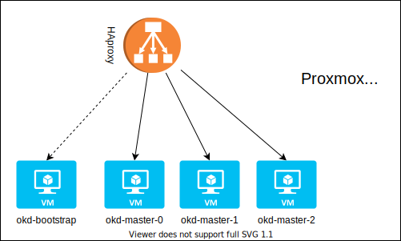

# okd-proxmox-scripts
Scripts for easy install OKD on Proxmox using qcow2 images and templates.

The scripts will help deploying 3 nodes okd 4.5 cluster

## Requirements
* Proxmox 6.x
* Enough resources 
  * CPU: 16 vcpu (at least 12vcpu, 4 for each master node)
  * RAM: 64 GB (32GB should be ok)
  * DISK: 500 GB (possibly SSD, better NVME)
* DHCP reservation for nodes
* DNS entries for nodes and haproxy

### Optional
* Pull-secret downloaded from RH: https://cloud.redhat.com/openshift/install/pull-secret

## Installation
Clone repository directly on Proxmox host
>git clone https://github.com/pvelati/okd-proxmox-scripts.git

## Steps
### 0. Setup a LXC container and setup HAproxy
>vim scripts/setup-haproxy.sh

* Edit IP addresses
* Execute command to compile conf and deploy haproxy LXC

>sh scripts/setup-haproxy.sh

### 1. Install clients
>sh scripts/setup-clients.sh
### 2. Download and extract QCOW2 image
>sh scripts/setup-qcow2-image.sh
### 3. Create template on Proxmox
>sh scripts/setup-template.sh
### 4. Compile install-config
>vim ignitions/install-config.yaml.ORIG

* Edit sshKey with your ssh public key
* Change baseDomain with your network domain
* Change pullSecret with your personal one or use `{“auths”:{“fake”:{“auth”: “bar”}}}`
* You can change other things if you want, but it's your resposability 👀

~~~~
apiVersion: v1
baseDomain: yourdomain.local
metadata:
  name: lab
compute:
- hyperthreading: Disabled
  name: worker
  replicas: 0
controlPlane:
  hyperthreading: Disabled
  name: master
  replicas: 3
networking:
  clusterNetwork:
  - cidr: 10.128.0.0/14
    hostPrefix: 23
  networkType: OpenShiftSDN
  serviceNetwork:
  - 172.30.0.0/16
platform:
  none: {}
fips: false
pullSecret: '{"auths" ... }'
sshKey: 'ssh-rsa AAAA...='
~~~~

### 5. Build ignitions files
>sh scripts/build-ignitions.sh
### 6. Start deployment
>sh scripts/deploy-all.sh

### 7. Check bootstrap execution
>./openshift-install wait-for bootstrap-complete --dir=ignitions/

And wait for completion. After that you can stop and delete bootstrap vm.
### 7. Check install status
>./openshift-install wait-for install-complete --dir=ignitions/

And wait for completion.

## Next steps not managed by scripts
1. Storage
2. Deployments
## Extra tools
### Clean
Delete all ignitions files
>sh scripts/clean.sh
### Destroy
Stop and delete all VMs and haproxy LXC
>sh scripts/delete-all.sh
